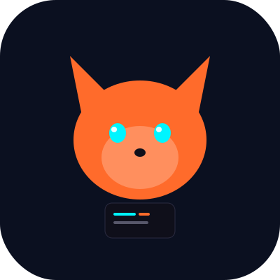

<p align="center">
  
</p>

<h1 align="center">ClawLite</h1>

<p align="center">
  
</p>

<p align="center">
  <a href="https://github.com/eobarretooo/ClawLite/releases/tag/v0.4.1"></a>
  <a href="LICENSE"></a>
  <a href="https://github.com/eobarretooo/ClawLite/stargazers"></a>
  
  
  
  
</p>

<p align="center">
  <a href="https://clawlite-site.vercel.app">🌐 Site</a> •
  <a href="https://eobarretooo.github.io/ClawLite/">📚 Docs</a> •
  <a href="https://clawlite-skills-site.vercel.app">🧩 Skills</a> •
  <a href="https://github.com/eobarretooo/ClawLite/issues">🐛 Issues</a> •
  <a href="https://github.com/eobarretooo/ClawLite/discussions">💬 Discussões</a>
</p>

---

## 📋 Tabela de conteúdo

- [Por que ClawLite](#por-que-clawlite)
- [Pré-requisitos](#pre-requisitos)
- [Instalando o Termux (Android)](#instalando-o-termux-android)
- [Instalação](#instalacao)
- [Features](#features)
- [Exemplos reais de uso](#exemplos-reais-de-uso)
- [Comparação](#comparacao)
- [Troubleshooting](#troubleshooting)
- [Roadmap](#roadmap)
- [Contribuindo](#contribuindo)
- [Star History](#star-history)
- [Licença](#licenca)

---

## 🧠 Por que ClawLite

> ClawLite é um assistente de IA focado em execução real — não só chat bonito.

CLI produtiva, gateway WebSocket, memória persistente entre sessões, 37 skills extensíveis, multi-agente em múltiplos canais e suporte a MCP — tudo rodando nativamente no Linux e Termux, sem proot, sem Docker, sem Node.js.

---

## ✅ Pré-requisitos

- Python 3.10+
- Linux (Ubuntu, Debian, Arch...) ou Termux no Android
- `curl` disponível no ambiente

### Instalando o Termux (Android)

> ⚠️ Importante: não instale o Termux pela Google Play Store — a versão lá está desatualizada e não recebe atualizações. Use o F-Droid.

Passo a passo:

1. Acesse [f-droid.org](https://f-droid.org) no navegador do seu Android e baixe o app do F-Droid.
2. Abra o F-Droid, pesquise por **Termux** e instale.
3. Ou baixe diretamente o APK mais recente em: https://github.com/termux/termux-app/releases/latest
4. Após instalar, abra o Termux e execute:

```bash
pkg update && pkg upgrade
pkg install python curl git
```

5. Pronto! Agora siga a instalação do ClawLite abaixo. 🦊

---

## 🚀 Instalação

```bash
curl -fsSL https://raw.githubusercontent.com/eobarretooo/ClawLite/main/scripts/install.sh | bash
```

### Quickstart em 5 minutos

```bash
# 1. Verificar ambiente
clawlite doctor

# 2. Configurar interativamente
clawlite onboarding

# 3. Ajustar configurações
clawlite configure

# 4. Verificar status
clawlite status

# 5. Iniciar gateway
clawlite start --host 0.0.0.0 --port 8787
```

```text
┌──────────────────────────────────────────────────────────────┐
│ $ clawlite doctor                                            │
│ python: ✓ sqlite: ✓ runtime: ✓                              │
│                                                              │
│ $ clawlite onboarding                                        │
│ [1/9] Idioma [2/9] Modelo [3/9] Canais ...                  │
│ ✅ Configuração salva                                         │
│                                                              │
│ $ clawlite start --port 8787                                │
│ 🦊 Gateway online → http://127.0.0.1:8787                    │
└──────────────────────────────────────────────────────────────┘
```

> 💡 O fluxo recomendado é o wizard interativo — sem editar JSON manualmente.

---

## ✨ Features

| Feature | Descrição |
|---|---|
| ⚙️ Onboarding interativo | Wizard estilo OpenClaw — Model, Channels, Skills, Hooks, Gateway, Security |
| 🌐 Gateway + Dashboard | WebSocket com chat ao vivo, logs filtráveis e telemetria em tempo real |
| 🧩 37 Skills | Marketplace com install/update/publish e trust policy |
| 🧠 Memória persistente | AGENTS/SOUL/USER/IDENTITY/MEMORY + diário + busca semântica |
| 📊 Learning system | Aprende com uso: métricas de sucesso, retry e preferências do usuário |
| 🔋 Runtime resiliente | Fallback offline com Ollama, cron por conversa, modo bateria |
| 🎙️ Voz STT/TTS | Pipeline de áudio integrado aos canais |
| 🤖 Multi-agente multi-canal | Agentes com identidade própria em Telegram, Slack, Discord, WhatsApp, Teams |
| 🔌 MCP | Suporte completo ao Model Context Protocol da Anthropic |
| 🌍 Idioma universal | PT-BR padrão + detecção automática de idioma do sistema |

---

## 💡 Exemplos reais de uso

### 1) Diagnóstico e setup inicial
```bash
clawlite doctor
clawlite onboarding
```

### 2) Dashboard web local
```bash
clawlite start --port 8787
# Abrir: http://127.0.0.1:8787
```

### 3) Gerenciar skills
```bash
clawlite skill search github
clawlite skill install github
clawlite skill auto-update --apply --strict
```

### 4) Memória semântica
```bash
clawlite memory semantic-search "preferências do usuário"
clawlite memory save-session "Resumo da sessão de hoje"
```

### 5) Skills na prática
```bash
# Listar issues do GitHub
clawlite run "use a skill github para listar issues abertas do repo"

# Transcrever áudio com Whisper
clawlite run "use whisper para transcrever ./audio/nota.ogg"
```

### 6) Multi-agente multi-canal
```bash
# Criar agentes especializados
clawlite agents create orchestrator --channel telegram --account main-bot --orchestrator
clawlite agents create dev --channel telegram --account dev-bot \
  --personality "engenheiro pragmático" --tag code --tag bug

# Vincular agente a múltiplos canais
clawlite agents bind dev --channel slack --account workspace-dev

# Listar agentes ativos
clawlite agents list
```

> 📖 Guia completo: [docs/MULTIAGENTE_MULTICANAL_PTBR.md](docs/MULTIAGENTE_MULTICANAL_PTBR.md)

### 7) MCP (Model Context Protocol)
```bash
# Instalar servidor MCP oficial
clawlite mcp install filesystem
clawlite mcp install github

# Gerenciar servidores
clawlite mcp list
clawlite mcp add meu-server https://example.com/mcp
clawlite mcp remove meu-server
```

> 📖 Docs MCP: [docs/MCP.md](docs/MCP.md)

---

## 🆚 Comparação

| Feature | ClawLite | OpenClaw | nanobot |
|---|:---:|:---:|:---:|
| Python puro | ✅ | ❌ Node.js | ✅ |
| Termux nativo (sem proot) | ✅ | ❌ | ✅ |
| Onboarding interativo PT-BR | ✅ | ✅ EN | ⚠️ |
| Learning system | ✅ | ❌ | ❌ |
| Multi-agente multi-canal | ✅ | ⚠️ parcial | ❌ |
| Offline com Ollama | ✅ | ❌ | ❌ |
| Dashboard web | ✅ | ✅ | ❌ |
| MCP suportado | ✅ | ❌ | ❌ |
| Skills marketplace | ✅ 37 | ✅ 5700+ | ⚠️ ~10 |

---

## 🛠️ Troubleshooting

<details>
<summary>Gateway não sobe na porta padrão</summary>

```bash
clawlite doctor
clawlite start --port 9090
```
</details>

<details>
<summary>Erro de dependência Python</summary>

```bash
python3 -m venv ~/.clawlite/venv
~/.clawlite/venv/bin/pip install -e .
```
</details>

Guia completo: [`docs/TROUBLESHOOTING.md`](docs/TROUBLESHOOTING.md)

---

## 🗺️ Roadmap

- [x] Gateway + dashboard v2
- [x] Multi-agente Telegram MVP
- [x] STT/TTS pipeline
- [x] MCP client/server
- [ ] Paridade completa de dashboard com OpenClaw
- [ ] Hardening final de produção v1

---

## 🤝 Contribuindo

PRs são bem-vindos! Leia [`CONTRIBUTING.md`](CONTRIBUTING.md).

---

## ⭐ Star History

[](https://star-history.com/#eobarretooo/ClawLite&Date)

---

## 📄 Licença

Distribuído sob licença **MIT**. Veja [LICENSE](LICENSE).
