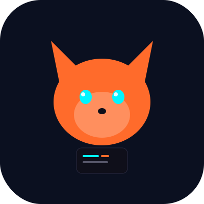

<div align="center">
  
  <h1>ClawLite</h1>
  <p><strong>Autonomous personal AI agent for Linux, built in Python.</strong></p>
  <p><strong>FastAPI gateway, Telegram-first operations, persistent memory, and real tool execution.</strong></p>
  <p>
    <a href="https://github.com/eobarretooo/ClawLite/actions/workflows/ci.yml"></a>
    
    
    <a href="LICENSE"></a>
  </p>
</div>

## ⚡ What Is ClawLite
ClawLite is a practical autonomous assistant focused on execution: it receives messages, runs tools, stores memory, schedules jobs, and sends proactive updates through channels.

## ✨ Main Features
- 🧠 **Unified agent engine** for CLI, HTTP API, WebSocket, scheduler, and channels.
- 💬 **Telegram-first channel support** with allowlist validation and long-message chunking.
- 🧩 **Skills via `SKILL.md`** with autoload and executable `command/script` actions.
- 🗓️ **Autonomous scheduling** with Cron jobs and heartbeat loops.
- 🗂️ **Persistent memory + sessions** stored under `~/.clawlite/state`.
- 🔌 **Multi-provider LLM support** (Gemini, OpenAI, OpenRouter, Groq, DeepSeek, Anthropic routing, Codex, custom OpenAI-compatible endpoints).
- 🛠️ **Tool execution** for shell, files, web, cron, message routing, skills, and subagents.

## 🚀 Quick Start (4 Steps)
1. **Clone and install**
```bash
git clone https://github.com/eobarretooo/ClawLite.git
cd ClawLite
python3 -m venv .venv
source .venv/bin/activate
pip install -U pip
pip install -e .
```

2. **Initialize workspace identity files**
```bash
clawlite onboard
```

3. **Create minimal config** (`~/.clawlite/config.json`)
```json
{
  "provider": {
    "model": "gemini/gemini-2.5-flash"
  },
  "channels": {
    "telegram": {
      "enabled": true,
      "token": "123456789:AA...",
      "allow_from": ["1850513297"]
    }
  }
}
```

4. **Export API key and start gateway**
```bash
export GEMINI_API_KEY="AIza..."
clawlite start --host 127.0.0.1 --port 8787
```

Health check:
```bash
curl -s http://127.0.0.1:8787/health
```

## 🔧 Minimal Config (Gemini + Telegram)
ClawLite loads config from `~/.clawlite/config.json` by default.

```json
{
  "workspace_path": "/home/your-user/.clawlite/workspace",
  "state_path": "/home/your-user/.clawlite/state",
  "provider": {
    "model": "gemini/gemini-2.5-flash"
  },
  "gateway": {
    "host": "127.0.0.1",
    "port": 8787
  },
  "scheduler": {
    "heartbeat_interval_seconds": 1800,
    "timezone": "UTC"
  },
  "channels": {
    "telegram": {
      "enabled": true,
      "token": "123456789:AA...",
      "allow_from": ["1850513297"],
      "poll_timeout_s": 20,
      "poll_interval_s": 1.0
    }
  }
}
```

Environment overrides supported:
- `CLAWLITE_MODEL`
- `CLAWLITE_LITELLM_API_KEY`
- `GEMINI_API_KEY`, `OPENAI_API_KEY`, `OPENROUTER_API_KEY`, `GROQ_API_KEY`, `DEEPSEEK_API_KEY`
- `CLAWLITE_GATEWAY_HOST`, `CLAWLITE_GATEWAY_PORT`

## 📡 Supported Channels
| Channel | Status | Notes |
|---|---|---|
| Telegram | ✅ Implemented | Polling, reconnection/backoff, allowlist, chunked outbound |
| Discord | ⚠️ Skeleton | Passive adapter placeholder |
| Slack | ⚠️ Skeleton | Passive adapter placeholder |
| WhatsApp | ⚠️ Skeleton | Passive adapter placeholder |
| Signal | ⚠️ Skeleton | Passive adapter placeholder |
| Google Chat | ⚠️ Skeleton | Passive adapter placeholder |
| Email | ⚠️ Skeleton | Passive adapter placeholder |
| Matrix | ⚠️ Skeleton | Passive adapter placeholder |
| IRC | ⚠️ Skeleton | Passive adapter placeholder |
| iMessage | ⚠️ Skeleton | Passive adapter placeholder |
| DingTalk | ⚠️ Skeleton | Passive adapter placeholder |
| Feishu | ⚠️ Skeleton | Passive adapter placeholder |
| Mochat | ⚠️ Skeleton | Passive adapter placeholder |
| QQ | ⚠️ Skeleton | Passive adapter placeholder |

## 🧰 CLI Commands
| Command | Purpose |
|---|---|
| `clawlite start [--host --port --config]` | Start FastAPI + WebSocket gateway |
| `clawlite run "<prompt>" [--session-id]` | Run one prompt through the engine |
| `clawlite onboard [--overwrite ...]` | Generate workspace identity templates |
| `clawlite skills list [--all]` | List discovered skills |
| `clawlite skills show <name>` | Show metadata/body of one skill |
| `clawlite cron add --session-id --expression --prompt [--name]` | Create scheduled job |
| `clawlite cron list --session-id` | List jobs for session |
| `clawlite cron remove --job-id` | Remove scheduled job |

## 🫀 Heartbeat + Cron (Real Examples)
Create a recurring cron job every 2 minutes:
```bash
clawlite cron add \
  --session-id telegram:1850513297 \
  --expression "every 120" \
  --prompt "Send me a concise project status update" \
  --name "status-ping"
```

Create a one-time reminder:
```bash
clawlite cron add \
  --session-id telegram:1850513297 \
  --expression "at 2026-03-02T20:00:00+00:00" \
  --prompt "Remind me to review release notes" \
  --name "release-reminder"
```

List active jobs:
```bash
clawlite cron list --session-id telegram:1850513297
```

Heartbeat interval is controlled by:
```json
{
  "scheduler": {
    "heartbeat_interval_seconds": 1800
  }
}
```

## 🐳 Docker
No official image is published yet. You can run ClawLite in a Python container:

```bash
docker run --rm -it \
  -p 8787:8787 \
  -v "$HOME/.clawlite:/root/.clawlite" \
  -v "$PWD:/app" \
  -w /app \
  python:3.12-bullseye \
  bash -lc "pip install -U pip && pip install -e . && clawlite start --host 0.0.0.0 --port 8787"
```

## 🤖 Supported Providers
| Provider | Model prefix example | Auth |
|---|---|---|
| Gemini | `gemini/gemini-2.5-flash` | `GEMINI_API_KEY` |
| OpenAI | `openai/gpt-4.1-mini` | `OPENAI_API_KEY` |
| OpenRouter | `openrouter/openai/gpt-4o-mini` | `OPENROUTER_API_KEY` |
| Groq | `groq/llama-3.3-70b-versatile` | `GROQ_API_KEY` |
| DeepSeek | `deepseek/deepseek-chat` | `DEEPSEEK_API_KEY` |
| Anthropic (routing) | `anthropic/claude-3-7-sonnet` | `ANTHROPIC_API_KEY` |
| OpenAI Codex | `openai-codex/codex-mini-latest` | Provider auth token |
| Custom OpenAI-compatible | `custom/<model>` | Configured key/base URL |

## 🏗️ Architecture
```text
clawlite/
├── core/         # engine, prompt builder, memory, skills, subagent loop
├── tools/        # tool abstractions and executable tools
├── bus/          # inbound/outbound events and async queue
├── channels/     # Telegram implementation + channel adapters
├── gateway/      # FastAPI app and WebSocket endpoint
├── scheduler/    # cron service and heartbeat service
├── providers/    # model provider resolution and HTTP adapters
├── session/      # session history store
├── workspace/    # bootstrap + prompt template files
├── skills/       # built-in SKILL.md files
├── config/       # schema + config loader
├── cli/          # command-line interface
└── utils/        # helpers and logging setup
```

## 🛣️ Roadmap
- **P0 Core Stability**: unified execution path, stronger integration tests, hardened input validation.
- **P1 Operational Autonomy**: resilient long-running operation, proactive channel delivery, stronger long-term memory.
- **P2 Ecosystem**: better skills UX, deeper MCP/provider integrations, tighter deployment and release runbooks.

See full plan in [`ROADMAP.md`](ROADMAP.md).

## 🤝 Contributing
Contributions are welcome.

- Read [`CONTRIBUTING.md`](CONTRIBUTING.md)
- Run tests before PR: `pytest -q tests`
- Keep docs aligned with runtime behavior

## 🙏 Acknowledgements
ClawLite is its own implementation.

Thanks to the open-source projects **nanobot** and **OpenClaw** for architectural inspiration and practical reference points.

## 📄 License
This project is licensed under the MIT License. See [`LICENSE`](LICENSE).
