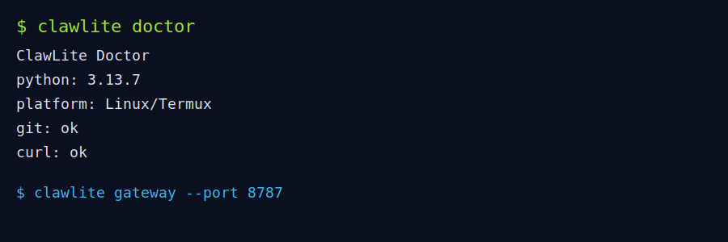

# ClawLite

[](#)
[](#)
[](https://github.com/eobarretooo/ClawLite)

```text
  ____ _                 _     _ _ _
 / ___| | __ ___      _| |   (_) | |_ ___
| |   | |/ _` \ \ /\ / / |   | | | __/ _ \
| |___| | (_| |\ V  V /| |___| | | ||  __/
 \____|_|\__,_| \_/\_/ |_____|_|_|\__\___|
```

Assistente open source portátil para **Linux + Termux**, com **gateway WebSocket**, onboarding guiado e arquitetura modular.

## 🚀 Instalação (1 comando)

```bash
curl -fsSL https://raw.githubusercontent.com/eobarretooo/ClawLite/main/scripts/install.sh | bash
```

## 📸 Terminal em ação



## Quickstart

```bash
clawlite onboarding
clawlite doctor
clawlite gateway --port 8787
```

Health check:

```bash
curl http://127.0.0.1:8787/health
```

## Gateway (server mode)

- WebSocket: `/ws?token=...`
- Auth por token
- Dashboard web: `/dashboard`
- Health check: `/health`
- Status protegido: `/api/status` (Bearer token)

## Skills disponíveis (MVP)

| Skill | Status | Descrição |
|---|---|---|
| core-tools | ✅ | read/write/exec local |
| memory | ✅ | memória local SQLite |
| gateway | ✅ | servidor WS + dashboard + health |
| onboarding | ✅ | setup interativo de modelo/canais/skills |
| subagents | 🟡 | planejado |
| messaging connectors | 🟡 | planejado |

## What People Are Building

- Assistente pessoal local para Termux
- Gateway de automação para bots de chat
- Shell copiloto para scripts Linux

## ClawLite vs OpenClaw

| Item | ClawLite | OpenClaw |
|---|---|---|
| Foco | Portabilidade Linux/Termux | Plataforma completa multiambiente |
| Setup | 1 comando + onboarding CLI | Infra/serviços mais completos |
| Dependências | Python puro + libs leves | Stack maior de runtime |
| Gateway | WS + dashboard embutidos | Gateway avançado nativo |

## Contribuição

1. Fork do repositório
2. Crie branch: `feat/minha-feature`
3. Commit e push
4. Abra PR com contexto + testes

## Licença

MIT


## Skills implementadas do catálogo

- `coding-agent`
- `github`
- `gmail`
- `google-calendar`
- `obsidian`
- `slack`
- `discord`
- `twitter`
- `threads`
- `web-search`
- `web-fetch`
- `browser`
- `docker`
- `ssh`
- `supabase`
- `firebase`
- `aws`
